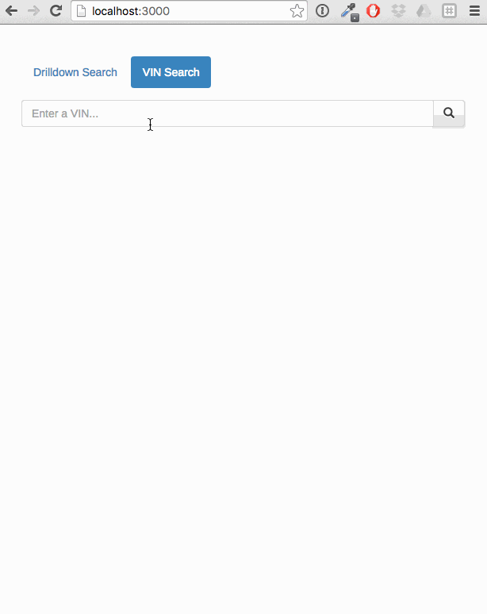

# Vehicle Search
Search for a vehicle by VIN or through the dropdowns. Makes are currently hardcoded, but everything subsequent is dynamically populated. View Black Book values and data around the searched vehicle. Fully responsive.

Built with HTML, CSS, jQuery, and JavaScript accessing data from the Black Book Used Car API.

# Screencast

